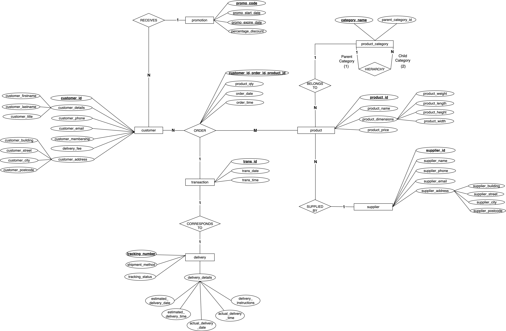
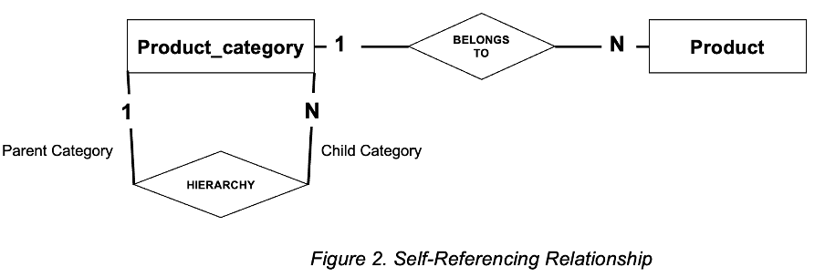
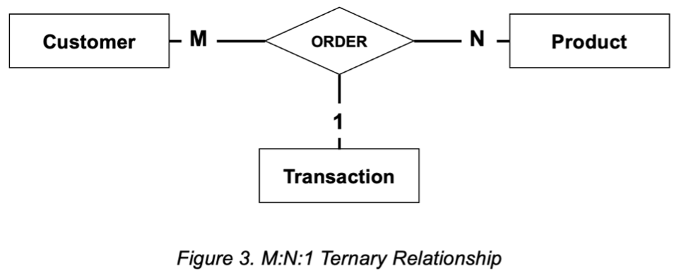
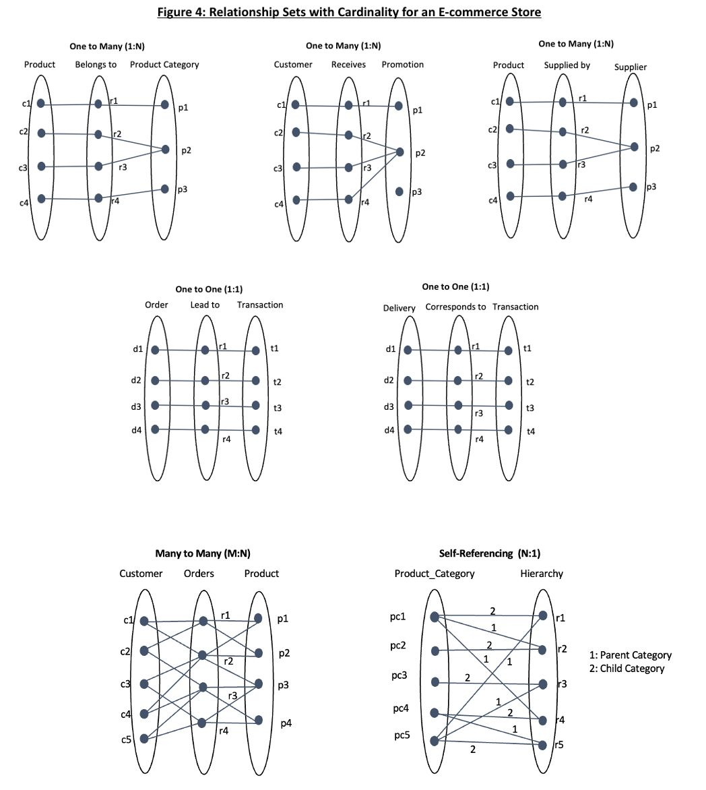
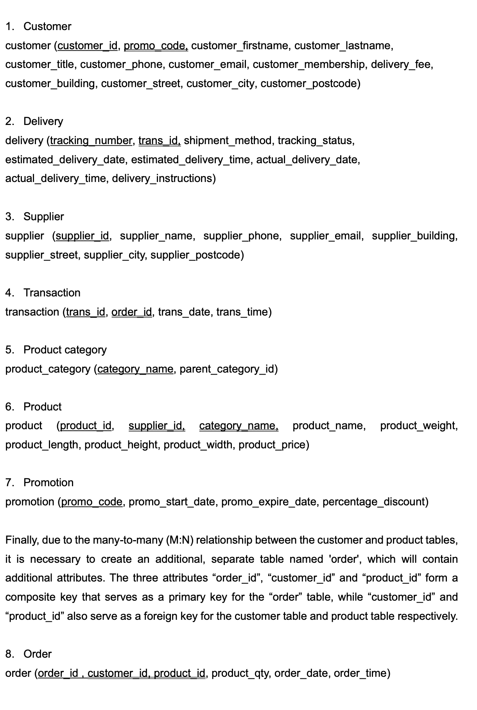
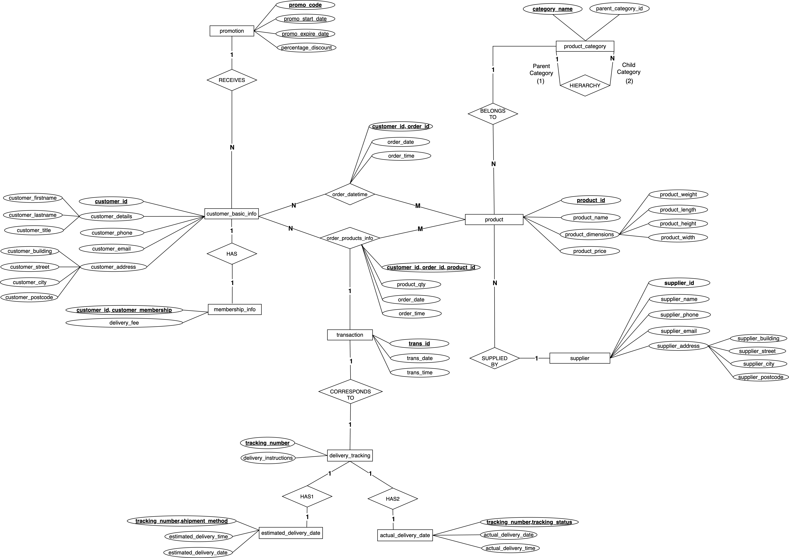
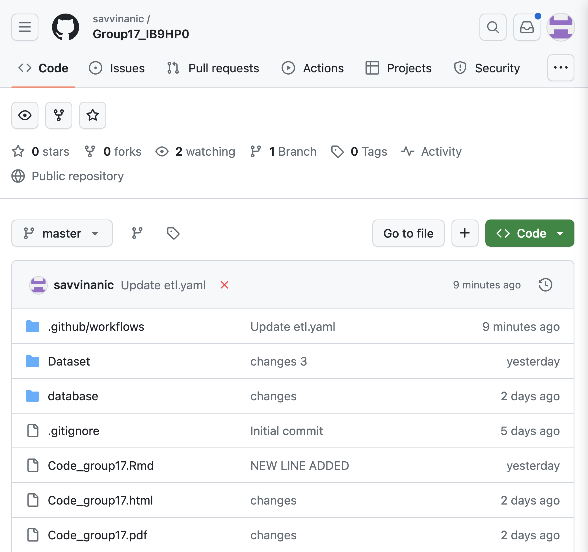
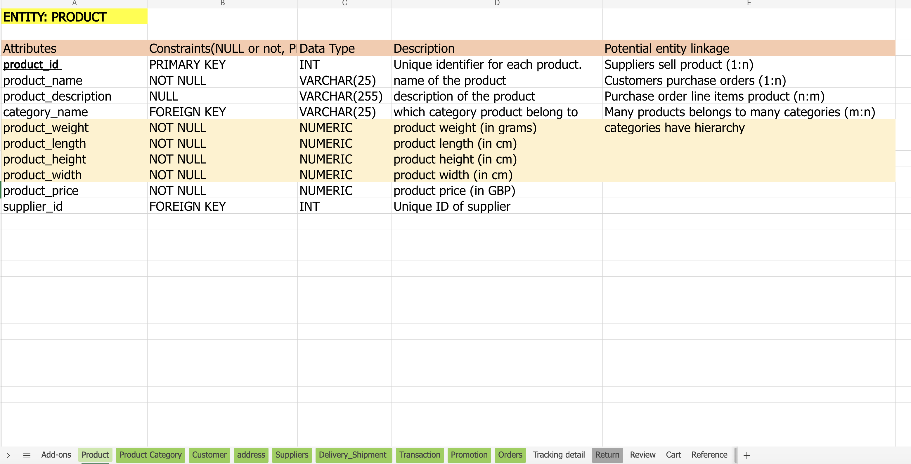

---
output:
  pdf_document: default
  html_document: default
  word_document: default
---
# Overview

The most crucial aspect of any thriving e-commerce business is the skilled management of data. Recognizing this, our project simulates a real-world e-commerce data environment, where our primary goal is to construct a robust database that can not only handle the high volume of transactions characteristic of busy online platforms but also organize data effectively to streamline operations. By recreating a realistic e-commerce scenario, we aim to ensure that businesses remain adaptable, perceptive, and ahead in the fast-paced world of e-commerce.

# Part 1: Database Design and Implementation

## 1.1 E-R Diagram Design

```{r echo=FALSE}
library(knitr)
opts_chunk$set(tidy.opts=list(width.cutoff=60),tidy=TRUE)
```

```{r echo=FALSE}

```

        
                                        Figure 1: ER Diagram 


The architecture of our e-commerce database is structured around seven key entities: customer, product, product category, supplier, promotion, transaction and delivery. We initially identified 12 entities, including review, return, cart, and advertisements, using an Excel spreadsheet (Appendix 5.1). However, identifying attributes, foreign keys and relationships proved challenging, especially in later SQL table creation stages. Therefore, we kept the seven most important to avoid any complexities. The final seven entities are intricately interconnected through a spectrum of relationships, including one-to-one, one-to-many, many-to-many, and self-referencing, in addition to a central ternary relationship. This comprehensive approach served as a roadmap guiding us through all subsequent stages of the database design.

The “customer” entity, uniquely identified by “customer_id”, holds detailed attributes and forms a many-to-many relationship with “product” entity, signifying that customers can purchase multiple products, and products can be purchased by various customers.

The “product” entity has “product_id” as the primary key and is linked to “product category”. It has a one-to-many relationship where one category can encompass numerous products. Furthermore, “product” is similarly linked with “supplier” entity that is uniquely identified by “supplier_id”. It is connected through a one-to-many relationship, under the assumption that one supplier provides numerous products.

The “product category” entity has a self-referencing relationship with “category_name” as the primary key. It is a hierarchical category structure with one-to-many relationship, as a single parent category can have multiple child categories, but each child category has only one parent category. For instance, “Beauty” is the parent category, and “Body Wash”, “Perfume” and “Hair Styling Product” are the child categories. Each of these child categories would refer to “Beauty” as their parent, creating a self-referencing relationship as is shown in figure 2.

```{r echo=FALSE}

```

The “promotion” entity with “promo_code” as the primary key engages in a one-to-many relationship with “customer” entity, under the assumption that one customer can be associated with one promo code, and many promo code can be associated with multiple customers.

Central to the database, “transaction” captures the financial exchanges and is part of a ternary relationship with “customer” and “product” entities. The three are connected with “order” relationship as is shown below in figure 3:

• A “customer” can have multiple “transaction” (N:1), and within each transaction, multiple “products” can be involved (M:1).

• A “product” can be part of multiple “transaction” through different “customers” (M:N), but within a specific transaction, it is uniquely identified.

```{r echo=FALSE}

```

Lastly, the “delivery” entity, with “delivery_id” as the primary key, correlates with “transaction” table in a one-to-one relationship, where each transaction results in a single delivery instance, ensuring that every purchase is accurately fulfilled.

All relationship sets are illustrated below based on each relationship between two entities:

```{r echo=FALSE}

```

## Assumptions

To shape our database's logical structure, we have established several assumptions. First, we assume that our E-commerce business commenced in June 2023. We have a singular supplier relationship where a product is supplied by only one supplier. Each customer and supplier have only one address within the United Kingdom, with every customer and supplier allowed to add only one email address and contact number. Furthermore, our operating procedure presumed that the recipient name for each order corresponds to the name provided by the customer during the ordering process. All product prices are listed in GBP, and a free delivery fee is applied to membership holders (shipment method such as express or next day will still be free). On the contrary, there’s a delivery fee for customers without membership. All deliveries are handled by our own company, and not by an external company and all products within each order are shipped in one parcel. The delivery time is between 7am – 5pm, and each parcel is delivered to each customer’s unique address. All transactions are considered as completed, with no pending or failed statuses, whereas orders placed prior to March 2024 are presumed to be delivered and completed. Lastly, membership fee is not considered as part of our revenue.

## Logical Schema

Upon completion of the ER diagram, we moved to the logical schema phase where each attribute corresponds to a column within that table. Consequently, seven tables are established to represent the seven entities: product_category, promotion, supplier, customer, delivery, product and transaction.

When designing the logical schema, a careful review of entity relationships is crucial to determine if any additional tables are required. Relationships with cardinalities of 1:1 or N:1 do not require extra tables or changes. However, in N:1 relationships, where multiple instances of one entity are associated with a single instance of another, the primary key from the entity on the “1”- weak side transforms into a foreign key in the table on the “N” – strong side. In our ER diagram, we observe that multiple products belong to one product_category (N:1), and multiple products are supplied by one supplier (N:1). Thus, the primary keys “category_name” and “supplier_id” of the weak side are both transferred to the product table as foreign keys. This is the same case for “promo_code” from the promotion table transferred to the customer table as a foreign key. Below is a list of logical schemas for all entities:

```{r echo=FALSE}

```


## Part 1.2: Database Schema Creation

The database schema creation process starts with establishing a connection and creating SQL tables for each entity, proactively dropping any pre-existing tables to avoid potential issues. Then we used the ‘CREATE TABLE’ statements to define the new tables within the database. Each table corresponds to an entity in the E-commerce system, which defines the corresponding attributes, data types, null or not null and foreign-primary keys. Also, we meticulously ensured that all tables are aligned with our conceptual and logical schema. 

```{r setup2, include=FALSE}
library(readr)
library(RSQLite)
library(dplyr)
library(DBI)
```


# Load Files in an sqlite database

```{r loadsqlite1,warning=FALSE,error=FALSE,message=FALSE,attr.source='.numberLines'}
#setup the connection
connection <- RSQLite::dbConnect(RSQLite::SQLite(),"hi_import.db")
```

# Drop tables

```{sql connection=connection}
DROP TABLE IF EXISTS product
```

```{sql connection=connection}
DROP TABLE IF EXISTS product_category
```

```{sql connection=connection}
DROP TABLE IF EXISTS promotion
```

```{sql connection=connection}
DROP TABLE IF EXISTS supplier
```

```{sql connection=connection}
DROP TABLE IF EXISTS "transaction"
```

```{sql connection=connection}
DROP TABLE IF EXISTS order_datetime
```

```{sql connection=connection}
DROP TABLE IF EXISTS order_products_info
```

```{sql connection=connection}
DROP TABLE IF EXISTS actual_delivery_date
```

```{sql connection=connection}
DROP TABLE IF EXISTS delivery_tracking
```

```{sql connection=connection}
DROP TABLE IF EXISTS estimated_delivery_date
```

```{sql connection=connection}
DROP TABLE IF EXISTS customer_membership
```

```{sql connection=connection}
DROP TABLE IF EXISTS customer_basic_info
```

```{sql connection=connection}
DROP TABLE IF EXISTS customer
```

```{sql connection=connection}
DROP TABLE IF EXISTS delivery
```

```{sql connection=connection}
DROP TABLE IF EXISTS "order"
```

# Create SQL tables

## product_category

```{sql connection=connection}
-- product_category
CREATE TABLE "product_category" ( 
  category_name VARCHAR(50) PRIMARY KEY,
  parent_category_id CHAR NULL
);
```

```{sql connection=connection}
SELECT * FROM "product_category";
```

## promotion

```{sql connection=connection}
-- promotion
CREATE TABLE "promotion" ( 
  promo_code INT PRIMARY KEY, 
  promo_start_date DATE NULL,
  promo_expire_date DATE NULL,
  percentage_discount NUMERIC NOT NULL
  );

```

```{sql connection=connection}
SELECT * FROM "promotion";
```

## supplier

```{sql connection=connection}
-- supplier
CREATE TABLE supplier ( 
  supplier_id INT PRIMARY KEY, 
  supplier_name CHAR NOT NULL,
  supplier_phone INT NOT NULL,
  supplier_email VARCHAR(50) NOT NULL,
  supplier_building INT NOT NULL,
  supplier_street VARCHAR(50) NOT NULL,
  supplier_city VARCHAR(50) NOT NULL,
  supplier_postcode VARCHAR(50) NOT NULL
) ; 
```

```{sql connection=connection}
SELECT * FROM "supplier";
```

## customer

```{sql connection=connection}
-- customer
CREATE TABLE "customer" ( 
  customer_id INT PRIMARY KEY, 
  promo_code INT,
  customer_firstname VARCHAR(50) NOT NULL,
  customer_lastname VARCHAR(50) NOT NULL,
  customer_title VARCHAR(25) NOT NULL, 
  customer_phone VARCHAR(50) NOT NULL,
  customer_email VARCHAR(50) NOT NULL,
  customer_membership TEXT NOT NULL, 
  delivery_fee NUMERIC NOT NULL,
  customer_building INT NOT NULL,
  customer_street VARCHAR(50) NOT NULL, 
  customer_city VARCHAR(50) NOT NULL, 
  customer_postcode VARCHAR(50) NOT NULL, 
  FOREIGN KEY (promo_code) REFERENCES "promotion"(promo_code)
) ; 
```

```{sql connection=connection}
SELECT * FROM "customer";
```


## product

```{sql connection=connection}
-- product
CREATE TABLE "product" ( 
  product_id INT PRIMARY KEY, 
  supplier_id INT,
  category_name VARCHAR(50),
  product_name VARCHAR(25) NOT NULL,
  product_weight NUMERIC NOT NULL,
  product_length NUMERIC NOT NULL,
  product_height NUMERIC NOT NULL,
  product_width NUMERIC NOT NULL,
  product_price NUMERIC NOT NULL,
  FOREIGN KEY (supplier_id) REFERENCES "supplier"(supplier_id),
  FOREIGN KEY (category_name) REFERENCES "product_category"(category_name)
) ; 

```

```{sql connection=connection}
SELECT * FROM "product";
```

## order

```{sql connection=connection}
-- order
CREATE TABLE "order" (
  order_id INT,
  customer_id INT,
  product_id INT,
  product_qty INT NOT NULL,
  order_date DATE NOT NULL, 
  order_time TIME NOT NULL,
  PRIMARY KEY (order_id, customer_id, product_id),
  FOREIGN KEY (customer_id) REFERENCES "customer"(customer_id),
  FOREIGN KEY (product_id) REFERENCES "product"(product_id)
) ; 
```

```{sql connection=connection}
SELECT * FROM "order";
```

## transaction

```{sql connection=connection}
-- transaction
CREATE TABLE "transaction" (
  trans_id INT PRIMARY KEY,
  order_id INT,
  trans_date DATE NOT NULL,
  trans_time TIME NOT NULL,
  FOREIGN KEY (order_id) REFERENCES "order"(order_id)
);

```

```{sql connection=connection}
SELECT * FROM "transaction";
```

## delivery

```{sql connection=connection}
-- delivery
CREATE TABLE "delivery" ( 
  tracking_number INT PRIMARY KEY, 
  trans_id INT,
  shipment_method VARCHAR(50) NOT NULL,
  tracking_status VARCHAR(50) NOT NULL,
  estimated_delivery_date DATE NOT NULL,
  estimated_delivery_time TIME NOT NULL,
  actual_delivery_date DATE NULL, 
  actual_delivery_time TIME NULL,
  delivery_instructions VARCHAR(125) NOT NULL,
  FOREIGN KEY (trans_id) REFERENCES "transaction"(trans_id)
); 
```

```{sql connection=connection}
SELECT * FROM "delivery";
```


# Normalization to 3NF

Next, we ensured data integrity by checking for normalization before importing the dataset into the database. Our group chose to generate the data before creating the empty tables in SQL. This approach facilitated the verification of whether all tables were normalized up to the Third Normal Form (3NF), ensuring optimal data organization and integrity.

Therefore, before importing the synthetic dataset, we checked if our tables were in the First Normal Form (1NF), which required atomic values. For instance, the “customer_address” attribute in the customer table required us to separate columns for “customer_building”, “customer_street”, and “customer_city”, ensuring each contained only a singular value. We then ensured compliance with the Second Normal Form (2NF) by ensuring all columns in all tables were only dependent on the primary keys and not any non-key attributes. For example, in transaction table, we computed the transaction amount by considering delivery fee, discount, quantity and products price. However, this calculation violated  2NF normalization principles and thus, we introduced a calculated field in SQL to handle this computation as it shown in the code after data validation and import. 

Next, in achieving 3NF, we divided the customer table into two: customer_basic_info for personal details, and customer_membership for membership and fees, correcting a transitive dependency where 'delivery_fee' relied on 'customer_membership', not the 'customer_id' primary key.

A similar approach was taken with the order table, where the composite key of “order_id”, “customer_id”, and “product_id” is the primary key. Since “order_date” and “order_time” were fully dependent only on “order_id” and “customer_id”, we segregated this information into a new table, order_datetime and order_products_info, thus removing the transitive dependency and aligning with 3NF principles. 

The delivery table was split into estimated_delivery_date, actual_delivery_date, and delivery_tracking to meet 3NF. The estimated_delivery_date table now separately records shipment methods with estimated times, resolving a transitive dependency. The actual_delivery_date table captures timestamps based on “tracking_status”, and the delivery_tracking table aligns `trans_id` and instructions with the `tracking_number` key.


## For customer

1.  customer_basic_info

```{sql connection=connection}
-- customer_basic_info
CREATE TABLE "customer_basic_info" ( 
  customer_id INT PRIMARY KEY, 
  promo_code INT,
  customer_firstname VARCHAR(50) NOT NULL,
  customer_lastname VARCHAR(50) NOT NULL,
  customer_title VARCHAR(25) NOT NULL, 
  customer_phone VARCHAR(50) NOT NULL,
  customer_email VARCHAR(50) NOT NULL,
  customer_building INT NOT NULL,
  customer_street VARCHAR(50) NOT NULL, 
  customer_city VARCHAR(50) NOT NULL, 
  customer_postcode VARCHAR(50) NOT NULL, 
  FOREIGN KEY (promo_code) REFERENCES "promotion"(promo_code)
) ; 
```

```{sql connection=connection}
SELECT * FROM customer_basic_info
```

2.  customer_membership

```{sql connection=connection}
-- customer_membership
CREATE TABLE "customer_membership" ( 
  customer_id INT, 
  customer_membership TEXT, 
  delivery_fee NUMERIC NOT NULL,
  PRIMARY KEY (customer_id, customer_membership),
  FOREIGN KEY (customer_id) REFERENCES "customer_basic_info"(customer_id)
);
```

```{sql connection=connection}
SELECT * FROM customer_membership
```

## For order

1.  order_products_info

```{sql connection=connection}
-- order_products_info
CREATE TABLE "order_products_info" (
  order_id INT,
  customer_id INT,
  product_id INT,
  product_qty INT NOT NULL,
  PRIMARY KEY (order_id, customer_id, product_id),
  FOREIGN KEY (customer_id) REFERENCES "customer_basic_info"(customer_id),
  FOREIGN KEY (product_id) REFERENCES "product"(product_id)
) ; 
```

```{sql connection=connection}
SELECT * FROM order_products_info
```

2.  order_datetime

```{sql connection=connection}
-- order_datetime
CREATE TABLE "order_datetime" (
  order_id INT,
  customer_id INT,
  order_date DATE NOT NULL, 
  order_time TIME NOT NULL,
  PRIMARY KEY (order_id, customer_id),
  FOREIGN KEY (customer_id) REFERENCES "customer_basic_info"(customer_id)
) ; 
```

```{sql connection=connection}
SELECT * FROM order_datetime
```

## For Delivery

1.  delivery_tracking

```{sql connection=connection}
-- delivery_tracking
CREATE TABLE "delivery_tracking" ( 
  tracking_number INT PRIMARY KEY, 
  trans_id INT,
  delivery_instructions VARCHAR(125) NOT NULL,
  FOREIGN KEY (trans_id) REFERENCES "transaction"(trans_id)
); 
```

```{sql connection=connection}
SELECT * FROM delivery_tracking
```

2.  estimated_delivery_date

```{sql connection=connection}
-- estimated_delivery_date
CREATE TABLE "estimated_delivery_date" ( 
  tracking_number INT, 
  shipment_method VARCHAR(50),
  estimated_delivery_date DATE NOT NULL,
  estimated_delivery_time TIME NOT NULL,
  PRIMARY KEY (tracking_number, shipment_method),
  FOREIGN KEY (tracking_number) REFERENCES "delivery_tracking"(tracking_number)
); 
```

```{sql connection=connection}
SELECT * FROM estimated_delivery_date
```

3.  actual_delivery_date

```{sql connection=connection}
-- actual_delivery_date
CREATE TABLE "actual_delivery_date" ( 
  tracking_number INT, 
  tracking_status VARCHAR(50),
  actual_delivery_date DATE NULL, 
  actual_delivery_time TIME NULL,
  PRIMARY KEY (tracking_number, tracking_status),
  FOREIGN KEY (tracking_number) REFERENCES "delivery_tracking"(tracking_number)
); 
```

```{sql connection=connection}
SELECT * FROM actual_delivery_date
```


The revised ER Normalized Diagram with the new entities of estimated_delivery_date, actual_delivery_date, delivery tracking, order_products info, order_datetime, customer_basic_info and customer_membership is presented in figure 5. 


```{r echo=FALSE}

```

  
                              Figure 5: ER Diagram - After Normalisation


# Part 2: Data Generation and Management

## Part 2.1: Synthetic Data Generation

We initially generated synthetic data using Mockaroo and ChatGPT, which was downloaded into an excel sheet by providing field names, data types, and other conditions. However, we faced various issues including the fact that the total number of products was equally distributed in each category. There was also inconsistency in the address for various customers and thus, we had to go back and provide more information to get the desired results. In addition, there was one main issue with this data, including improper format and unordered date and time across promotion, order, transaction and delivery table. To correct this issue, we used R to re-generate this data for all related tables with conditions to ensure that promotion code is applicable during operation period (Appendix 5.2). We changed date and time data since they should follow a synchronized order: a customer places an order by making a transaction and then we have the date and time when the order is delivered. In addition, for delivery table, we also generated the estimated and actual delivery date based on the condition of shipment method. 

## Part 2.2: Data Quality Assurance and Import

# Data Validation 
In our pursuit of ensuring data integrity, we implemented a comprehensive quality assurance process which included:

1. Verification of the total number of rows and columns.
2. Data structure and formats.
3. Null values.
4. Validation of primary keys.
5. Validate phone number
6. Validate email address
7. Referential Integrity Check

By using a “for loop”, we are able to perform these checks across all columns in each table. Each dataset should be verified to have unique value for primary key and no missing value for fields which required to have information. However, for Order dataset, there are some unique requirements as we have component primary key, we have created different process to handle this scenario. Furthermore, in Customer dataset, there are e-mail and phone number columns, which required specific format checks. For e-mail, special characters “@” and ending domain must be validated. For phone number, IT must be ensured to have 10 numeric characters. Lastly, we perform referential integrity checks to ensure that each table has the required foreign keys that are consistent with the primary keys of other tables within the 'Dataset' folder. 

# List all files

```{r}
all_files <- list.files("Dataset/")
all_files
```

```{r block2,attr.source='.numberLines'}
prefix <- "hi_"
suffix <- "_dataset.csv"
all_files <- gsub("hi_","",all_files)
all_files <- gsub("_dataset.csv","",all_files)
all_files
```

In our pursuit of ensuring data integrity, we implemented a comprehensive quality assurance process which included:

## 1.  Check number of rows and columns

```{r loop,message=FALSE,warning=FALSE,attr.source='.numberLines'}
all_files <- list.files("Dataset/")

for (variable in all_files) {
  this_filepath <- paste0("Dataset/",variable)
  this_file_contents <- readr::read_csv(this_filepath)
  
  number_of_rows <- nrow(this_file_contents)
  number_of_columns <- ncol(this_file_contents)
  
  print(paste0("The file: ",variable,
              " has: ",
              format(number_of_rows,big.mark = ","),
              " rows and ",
              number_of_columns," columns"))
}
```

## 2. Check the data structure

```{r loop1,message=FALSE,warning=FALSE,attr.source='.numberLines'}
all_files <- list.files("Dataset/")

for (variable in all_files) {
  this_filepath <- paste0("Dataset/",variable)
  this_file_contents <- readr::read_csv(this_filepath)
  data_structure<-str(this_file_contents)
  
  print(paste0(data_structure,
               "The file: ",variable,
              " has above data structure"))
}
```

## 3. Check for NULL values

```{r loop2,message=FALSE,warning=FALSE,attr.source='.numberLines'}
all_files <- list.files("Dataset/")

for (variable in all_files) {
  this_filepath <- paste0("Dataset/",variable)
  this_file_contents <- readr::read_csv(this_filepath)
  null<-sum(is.na(this_file_contents))
  
  print(paste0("The file: ",variable,
              " has a total of ", null,
              " NULL values"))
}
```

## 4. Check that each primary key is unique in each table except for order

```{r loop3,message=FALSE,warning=FALSE,attr.source='.numberLines'}
all_files <- list.files("Dataset/")

for (variable in all_files) {
  this_filepath <- paste0("Dataset/",variable)
  this_file_contents <- readr::read_csv(this_filepath)
  hi <- nrow(unique(this_file_contents[,1]))== nrow(this_file_contents)
  
  print(paste0("The file: ",variable,
              " has unique primary key ",
              hi," columns"))
}
```

## For order dataset

We have a composite primary key orderdate_dataset composed of 2 attribute and a composite primary key orderproductsinfo_dataset composed of 3 attribute, we'll check these one separately.

```{r getindividualvalues}
orderdate_dataset <- read.csv("Dataset/hi_order_datetime_dataset.csv")
orderproductsinfo_dataset <- read.csv("Dataset/hi_order_products_info_dataset.csv")
nrow(unique(orderdate_dataset[,1:2])) == nrow(orderdate_dataset)
nrow(unique(orderproductsinfo_dataset[,1:3])) == nrow(orderproductsinfo_dataset)
#sum(nrow(unique(orders[,1:2])))
#length((unique(orders$cutomer_id)))
#length((unique(orders$order_id)))
#The file: hi_order_dataset.csv has unique primary composite key TRUE columns
```


In Customer dataset, there are e-mail and phone number columns, which required specific format checks. For e-mail, special characters “@” and ending domain must be validated. For phone number, IT must be ensured to have 10 numeric characters.

## 5. Validate phone number

```{r getindividualvalues1}
# Supplier
supplier_dataset <- read.csv("Dataset/hi_supplier_dataset.csv")
length(grepl("\\+44\\s\\d{3}\\s\\d{3}\\s\\d{4}", supplier_dataset$supplier_phone)) == nrow(supplier_dataset)
# Customer
customer_basic_info_dataset <- read.csv("Dataset/hi_customer_basic_info_dataset.csv")
length(grepl("\\+44\\s\\d{3}\\s\\d{3}\\s\\d{4}", customer_basic_info_dataset$customer_phone)) == nrow(customer_basic_info_dataset)
```

## 6. Validate email address

```{r getindividualvalues2}
# Supplier
length(grepl("@", supplier_dataset$supplier_email)) == nrow(supplier_dataset)
# Consumer
length(grepl("@", customer_basic_info_dataset$customer_email)) == nrow(customer_basic_info_dataset)
```


## 7. Referential Integrity Check

```{r}
#Customer info - Promo_code
customer_basic_info_dataset <- read.csv("Dataset/hi_customer_basic_info_dataset.csv")
promotion_dataset <- read.csv("Dataset/hi_promotion_dataset.csv")

referential_integrity1 <- customer_basic_info_dataset  %>%
  anti_join(promotion_dataset, by = "promo_code")
if (nrow(referential_integrity1) == 0) {
  cat("customer - promo_code referential integrity check passed.\n")
} else {
  cat("customer - promo_code referential integrity check failed.\n")
  print(referential_integrity1)
}

#Customer info - Customer membership
customer_membership_dataset <- read.csv("Dataset/hi_customer_membership_dataset.csv")

referential_integrity2 <- customer_basic_info_dataset  %>%
  anti_join(customer_membership_dataset, by = "customer_id")
if (nrow(referential_integrity2) == 0) {
  cat("customer_info - customer membership referential integrity check passed.\n")
} else {
  cat("customer_info - customer membership referential integrity check failed.\n")
  print(referential_integrity2)
}

#Order-Customer-product
order_products_info_dataset <- read.csv("Dataset/hi_order_products_info_dataset.csv")
product_dataset <- read.csv("Dataset/hi_product_dataset.csv")

referential_integrity3 <- order_products_info_dataset  %>%
  anti_join(customer_basic_info_dataset, by = "customer_id")
if (nrow(referential_integrity3) == 0) {
  cat("order - customer_id referential integrity check passed.\n")
} else {
  cat("order - customer_info referential integrity check failed.\n")
  print(referential_integrity3)
}
referential_integrity4 <- order_products_info_dataset  %>%
  anti_join(product_dataset, by = "product_id")
if (nrow(referential_integrity4) == 0) {
  cat("order - product_id referential integrity check passed.\n")
} else {
  cat("order - product_id referential integrity check failed.\n")
  print(referential_integrity4)
}

#order_date_time - customer_info
order_datetime_dataset <- read.csv("Dataset/hi_order_datetime_dataset.csv")

referential_integrity5 <- order_datetime_dataset  %>%
  anti_join(customer_basic_info_dataset, by = "customer_id")
if (nrow(referential_integrity5) == 0) {
  cat("order_date_time - customer_info referential integrity check passed.\n")
} else {
  cat("order_date_time - customer_info referential integrity check failed.\n")
  print(referential_integrity5)
}

#delivery-transaction_id
delivery_tracking_dataset <- read.csv("Dataset/hi_delivery_tracking_dataset.csv")
transaction_dataset <- read.csv("Dataset/hi_transaction_dataset.csv")

referential_integrity6 <- delivery_tracking_dataset  %>%
  anti_join(transaction_dataset, by = "trans_id")
if (nrow(referential_integrity6) == 0) {
  cat("delivery- transaction_id referential integrity check passed.\n")
} else {
  cat("delivery- transaction_id referential integrity check failed.\n")
  print(referential_integrity6)
}

#estimated_deli - tracking_number
estimated_delivery_date_dataset <- read.csv("Dataset/hi_estimated_delivery_date_dataset.csv")

referential_integrity7 <- estimated_delivery_date_dataset  %>%
  anti_join(delivery_tracking_dataset, by = "tracking_number")
if (nrow(referential_integrity7) == 0) {
  cat("estimated_delivery - tracking_number referential integrity check passed.\n")
} else {
  cat("estimated_delivert - tracking_number referential integrity check failed.\n")
  print(referential_integrity7)
}

#actual_deli - tracking
actual_delivery_date_dataset <- read.csv("Dataset/hi_actual_delivery_date_dataset.csv")

referential_integrity8 <- actual_delivery_date_dataset  %>%
  anti_join(delivery_tracking_dataset, by = "tracking_number")
if (nrow(referential_integrity8) == 0) {
  cat("actual_delivery - tracking_number referential integrity check passed.\n")
} else {
  cat("actual_delivery - tracking_number referential integrity check failed.\n")
  print(referential_integrity8)
}


#product-supplier-category
supplier_dataset <- read.csv("Dataset/hi_supplier_dataset.csv")
product_category_dataset <- read.csv("Dataset/hi_product_category_dataset.csv")

referential_integrity9 <- product_dataset  %>%
  anti_join(supplier_dataset, by = "supplier_id")
if (nrow(referential_integrity9) == 0) {
  cat("product-supplier referential integrity check passed.\n")
} else {
  cat("product-supplier referential integrity check failed.\n")
  print(referential_integrity9)
}
referential_integrity10 <- product_dataset  %>%
  anti_join(product_category_dataset, by = "category_name")
if (nrow(referential_integrity10) == 0) {
  cat("product-category referential integrity check passed.\n")
} else {
  cat("product-category referential integrity check failed.\n")
  print(referential_integrity10)
}


#transaction - order
transaction_dataset <- read.csv("Dataset/hi_transaction_dataset.csv")

referential_integrity11 <- transaction_dataset  %>%
  anti_join(order_products_info_dataset, by = "order_id")
if (nrow(referential_integrity11) == 0) {
  cat("product-category referential integrity check passed.\n")
} else {
  cat("product-category referential integrity check failed.\n")
  print(referential_integrity11)
}
```


# Import Datasets
Next we imported csv files into SQL table for all datasets, including the ones we generated after normalization.

## For loop to read csv and then import into sql

```{r}
# Read datasets
#order
order_datetime_dataset <- read.csv("Dataset/hi_order_datetime_dataset.csv")
order_products_info_dataset <- read.csv("Dataset/hi_order_products_info_dataset.csv")

#delivery

actual_delivery_date_dataset <- read.csv("Dataset/hi_actual_delivery_date_dataset.csv")
delivery_tracking_dataset <- read.csv("Dataset/hi_delivery_tracking_dataset.csv")
estimated_delivery_date_dataset <- read.csv("Dataset/hi_estimated_delivery_date_dataset.csv")

#customer
customer_basic_info_dataset <- read.csv("Dataset/hi_customer_basic_info_dataset.csv")
customer_membership_dataset <- read.csv("Dataset/hi_customer_membership_dataset.csv")
product_dataset <- read.csv("Dataset/hi_product_dataset.csv")
product_category_dataset <- read.csv("Dataset/hi_product_category_dataset.csv")
promotion_dataset <- read.csv("Dataset/hi_promotion_dataset.csv")
supplier_dataset <- read.csv("Dataset/hi_supplier_dataset.csv")
transaction_dataset <- read.csv("Dataset/hi_transaction_dataset.csv")
```

```{r loadsqlite,warning=FALSE,error=FALSE,message=FALSE,attr.source='.numberLines'}
dbWriteTable(connection, "product", product_dataset, append = TRUE, row.names = FALSE)
dbWriteTable(connection, "product_category", product_category_dataset, append = TRUE, row.names = FALSE)
dbWriteTable(connection, "promotion", promotion_dataset, append = TRUE, row.names = FALSE)
dbWriteTable(connection, "supplier", supplier_dataset, append = TRUE, row.names = FALSE)
dbWriteTable(connection, "transaction", transaction_dataset, append = TRUE, row.names = FALSE)

#order
dbWriteTable(connection, "order_datetime", order_datetime_dataset, append = TRUE, row.names = FALSE)
dbWriteTable(connection, "order_products_info", order_products_info_dataset, append = TRUE, row.names = FALSE)

#delivery
dbWriteTable(connection, "actual_delivery_date", actual_delivery_date_dataset, append = TRUE, row.names = FALSE)
dbWriteTable(connection, "delivery_tracking", delivery_tracking_dataset, append = TRUE, row.names = FALSE)
dbWriteTable(connection, "estimated_delivery_date", estimated_delivery_date_dataset, append = TRUE, row.names = FALSE)

#customer
dbWriteTable(connection, "customer_membership", customer_membership_dataset, append = TRUE, row.names = FALSE)
dbWriteTable(connection, "customer_basic_info", customer_basic_info_dataset, append = TRUE, row.names = FALSE)
```

## Check the tables using select

```{sql connection=connection}
SELECT * FROM "product" LIMIT 5
```

```{sql connection=connection}
SELECT * FROM "product_category" LIMIT 5
```

```{sql connection=connection}
SELECT * FROM "promotion" LIMIT 5
```

```{sql connection=connection}
SELECT * FROM "supplier" LIMIT 5
```

```{sql connection=connection}
SELECT * FROM "transaction" LIMIT 5
```

Order:

```{sql connection=connection}
SELECT * FROM "order_datetime" LIMIT 5
```

```{sql connection=connection}
SELECT * FROM "order_products_info" LIMIT 5
```

Delivery

```{sql connection=connection}
SELECT * FROM "actual_delivery_date" LIMIT 5
```

```{sql connection=connection}
SELECT * FROM "delivery_tracking" LIMIT 5
```

```{sql connection=connection}
SELECT * FROM "estimated_delivery_date" LIMIT 5
```

Customer:

```{sql connection=connection}
SELECT * FROM "customer_membership" LIMIT 5
```

```{sql connection=connection}
SELECT * FROM "customer_basic_info" LIMIT 5
```

# Calculated Field we created as we mentioned above for Normalization

## Transaction amount

```{sql connection=connection}
SELECT o.order_id, prm.percentage_discount, m.delivery_fee, SUM(p.product_price*o.product_qty) AS order_price, ROUND(SUM(p.product_price* o.product_qty)*(1 - CAST(prm.percentage_discount AS REAL) / 100) + m.delivery_fee,2) AS trans_amount
FROM "order_products_info" o, "product" p, "promotion" prm, "customer_basic_info" c, "customer_membership" m
WHERE o.customer_id = m.customer_id AND o.product_id = p.product_id AND c.promo_code = prm.promo_code AND m.customer_id = c.customer_id
GROUP BY 
    o.order_id;

```

# Store natively it in R

```{r}
# Customer
customer_membership <- dbReadTable(connection, "customer_membership")
customer_basic_info <- dbReadTable(connection, "customer_basic_info")

#Delivery
actual_delivery_date <- dbReadTable(connection, "actual_delivery_date")
delivery_tracking <- dbReadTable(connection, "delivery_tracking")
estimated_delivery_date <- dbReadTable(connection, "estimated_delivery_date")

#Order
order_datetime <- dbReadTable(connection, "order_datetime")
order_products_info <- dbReadTable(connection, "order_products_info")

product <- dbReadTable(connection, "product")
product_category <- dbReadTable(connection, "product_category")
promotion <- dbReadTable(connection, "promotion")
supplier <- dbReadTable(connection, "supplier")
transaction <- dbReadTable(connection, "transaction")
```

# List tables

```{r listtables}
RSQLite::dbListTables(connection)
```

# Disconnect SQL

```{r disconnect}
#RSQLite::dbDisconnect(connection)
```


# Part 3: Data Pipeline Generation

## Part 3.1: GitHub Repository and Workflow Setup

The purpose was to automate the process of updating and maintaining an R project on GitHub, making it easier for our team to collaborate and keep our project up to date. By committing changes and pressing "push" and "pull" we managed to synchronize the files "R_code.R" and "Dataset" where we stored our csv files. Despite solely utilizing the R script, we ensured all pertinent files were maintained within the repository. This was achieved by leveraging the repository's URL and executing commits and pushes whenever modifications were made. The URL is this: https://github.com/savvinanic/Group17_IB9HP0.


```{r echo=FALSE}

```

## Part 3.2: GitHub Actions for Continuous Integration

We commence by establishing the workflow, which activates in response to any push or pull requests. Once the equired R environment and packages are installed, it reads the R script file named "R_code.R". This file orchestrates a spectrum of operations encompassing SQL table creation, data validation, database updates, and visualization tasks. All generated graphs, pivotal for fostering informed decision-making and strategic planning within our E-commerce realm, are stored within the "figures" folder. Consequently, with each alteration, the workflow seamlessly automates all activities delineated within the R script file.

All changes are systematically pushed to the master branch,  requiring the use of our unique token for authentication.Notably, this workflow operates on a recurring schedule, executing every 3 hours, ensuring our project's continuous alignment with any changes or updates.

```{r echo=FALSE}
knitr::include_graphics("")
```

The code is added below:

```{}
name: Update Repo with result

on:
#  schedule:
#    - cron: '0 */3 * * *' # Run every 3 hours
  push:
    branches: [ master ]
    paths:
    - '.github/workflows/**'
    - 'R_codelast'
    - 'Dataset/**'
  
jobs:
  build:
    runs-on: ubuntu-latest
    steps:
      - name: Checkout code
        uses: actions/checkout@v2
      - name: Setup R environment
        uses: r-lib/actions/setup-r@v2
        with:
          r-version: '4.2.0'
      - name: Cache R packages
        uses: actions/cache@v2
        with:
          path: ${{ env.R_LIBS_USER }}
          key: ${{ runner.os }}-r-${{ hashFiles('**/lockfile') }}
          restore-keys: |
            ${{ runner.os }}-r-
      - name: Install packages
        if: steps.cache.outputs.cache-hit != 'true'
        run: |
          Rscript -e 'install.packages(c("ggplot2", "dplyr", "readr", "RSQLite"))'
      
      - name: Execute R script
        run: |
          Rscript R_codelast.R
      - name: Add files
        run: |
         git config --global --unset-all "http.https://github.com/.extraheader" || true
         git config --global user.email "savvinanicolaou@gmail.com"
         git config --global user.name "savvinanic"
         git add .
      - name: Commit files
        run: |
          git commit -m "Update Database"
      - name: Push changes 
        uses: ad-m/github-push-action@v0.6.0
        with:
          github_token: ${{ secrets.MY_TOKEN }}
          branch: master

```


# Part 4: Data Analysis and Reporting

# Data Visualisation
In this section we created diverse graphs including bar, line and pie charts and tables in SQL. This is vital as it will provide us with insights about potential issues, customer satisfaction and experience, if they are any areas of improvement in various operations like delivery service, sales by city, membership and promotions. Below are listed all titles and different visualizations we generated.

1. Product Category vs Count
2. Sales by Category
3. Product Category vs Average Order quantity per order 
4. Product Category vs Average Order quantity per month
5. Number of orders placed each hour of the day 
6. Compute the average Delivery delay by the three types of shipment methods
7. Percentage of customers having a Membership
8. Sales by Membership Status
9. Order delay - Membership
10. Monthly Revenue by City
11. Top 5 Products by Sales Volume and Total Sales Profit After Discount
12. Top 5 products sold and percentage discount applied
13. Top 10 customers with the highest transaction amount, percentage discount applied and products bought
14. Supplier sales volume
15. Supplier revenue


```{r echo=FALSE}
#Upload required packages 
library(ggplot2)
library(readr)
library(RSQLite)
library(dplyr)
library(DBI)
library(ggplot2)
library(tidyverse)
library(emmeans)
library(gridExtra)
library(knitr)
```

# 1. Product Category vs Count

The graph provides a clear overview of the diversity and distribution of products within different categories, informing strategic decisions regarding resource allocation, market segmentation, and competitive positioning.
```{r, connection = connection}
product_procat_join <- dbGetQuery(connection, "
  SELECT p.*, pc.parent_category_id
  FROM product AS p
  INNER JOIN product_category AS pc ON p.category_name = pc.category_name
")
```
 
```{r}
product_procat_join %>%
  group_by(parent_category_id) %>%
  summarise(count = n()) %>%
  ggplot(aes(x = factor(parent_category_id), y = count, fill = factor(parent_category_id))) +
  geom_bar(stat = "identity", position = "dodge", color = "black", alpha = 0.7) +
  labs(title = "Product Count by Parent Category",
       x = "Parent Category",
       y = "Count") +
  scale_fill_brewer(name = "Parent Category", palette = "Set3") +
  theme_minimal() +  # Apply minimal theme
  theme(axis.text.x = element_text(angle = 45, hjust = 1))
```

- There's an equal distribution of type of products stored in our E-Commerce store.

```{r, connection = connection}
dbWriteTable(connection, "product_procat_join_dataset", product_procat_join, overwrite = TRUE)
```


# 2. Sales by Category

This graph highlights which categories provide the highest number of total sales. This also illustrates where our E-commerce strengthens in terms of product category, which will help us determine which category to focus on to increase our revenue.

```{r, connection = connection}
order_product_join <- dbGetQuery(connection, "
SELECT op.order_id, op.customer_id, op.product_id, p.parent_category_id, op.product_qty, p.product_price, od.order_date
FROM `order_products_info` AS op
INNER JOIN order_datetime AS od ON op.order_id = od.order_id
INNER JOIN product_procat_join_dataset AS p ON op.product_id = p.product_id
")
```


```{r}
my_colors <- c("#1f78b4", "#33a02c", "#e31a1c", "#ff7f00", "#6a3d9a", "#b15928", "#a6cee3", "#b2df8a", "#fb9a99", "#fdbf6f")

category_wise_sales <- order_product_join %>%
  group_by(parent_category_id) %>%
  summarise(Total_sales = sum(product_qty*product_price))
 
ggplot(category_wise_sales, aes(x = factor(parent_category_id), y = Total_sales, fill = factor(parent_category_id))) +
  geom_bar(stat = "identity", color = "black") +
  scale_fill_manual(values = my_colors) +  
  labs(x = "Categories", y = "Total Sale (in £)", title = "Category-wise Sales") +
  theme_minimal() +  
  theme(axis.text.x = element_text(angle = 45, hjust = 1),  # Rotate x-axis labels
        legend.position = "none")  
```

- Beauty, books and grocery are the top three categories with the highest number of total sales. However, all categories have very similar total number of sales. Therefore, we might need to focus on the ones that lie within our company's marketing objectives.


# 3. Product Category vs Average Order quantity per order 

The graph provides insights for inventory management by ensuring sufficient stock of popular items while minimizing excess inventory for less frequently ordered products. Additionally, it enables targeted promotions for products with higher average quantities and facilitates personalized product recommendations for customers.

```{r, connection = connection}
orderqty_category_join <- dbGetQuery(connection, "
SELECT pc.parent_category_id, AVG(o.product_qty) AS avg_order_quantity
FROM `order_products_info` AS o
INNER JOIN product AS p ON o.product_id = p.product_id
INNER JOIN product_category AS pc ON p.category_name = pc.category_name
GROUP BY pc.parent_category_id
")
```
 
```{r}
ggplot(orderqty_category_join, aes(x = factor(parent_category_id), 
                                   y = avg_order_quantity, 
                                   fill = parent_category_id)) +
  geom_bar(stat = "identity", 
           position = "dodge", 
           color = "black", 
           alpha = 0.7) +
  labs(title = "Avg. Order Quantity by Product Category per Order",
       x = "Product Category",
       y = "Avg. Order Quantity / Order") +
  scale_fill_discrete(name = "Product Category") +
  theme_minimal() +  
  theme(axis.text.x = element_text(angle = 45, hjust = 1)) 
```

 
- We observe that two products of the same category are usually bought together per order.
 
 
# 4. Product Category vs Average Order quantity per month

These plots visualize average order quantity trends on a monthly basis that allows us to identify seasonal patterns and fluctuations in customer purchasing behavior over time. We also examine trends within specific categories to gain a deeper understanding of which product categories drive the most sales and how their performance varies over time. 
```{r, connection = connection}
order_products_datetime <- dbGetQuery(connection, "
SELECT o.*, op.product_id, op.product_qty
FROM `order_datetime` AS o
INNER JOIN order_products_info AS op ON o.order_id = op.order_id
")
```
 
```{r, connection = connection}
dbWriteTable(connection, "order_products_datetime_dataset", order_products_datetime, overwrite = TRUE)
```
 
```{r, connection = connection}
monthly_orderqty_category_join <- dbGetQuery(connection, "
SELECT pc.parent_category_id, o.order_date, o.product_qty
FROM `order_products_datetime_dataset` AS o
INNER JOIN product AS p ON o.product_id = p.product_id
INNER JOIN product_category AS pc ON p.category_name = pc.category_name
")
```
 
```{r}
# Convert order_date to date format
monthly_orderqty_category_join <- monthly_orderqty_category_join %>%
  mutate(order_date = as.Date(order_date))
 
# Extract month from order_date
monthly_orderqty_category_join <- monthly_orderqty_category_join %>%
  mutate(month = format(order_date, "%m-%Y"))
 
# Calculate average order quantity for each product and each month
avg_order_quantity <- monthly_orderqty_category_join %>%
  group_by(parent_category_id, month) %>%
  summarise(avg_qty = mean(product_qty))
 

# Per product category
ggplot(avg_order_quantity, aes(x = month, y = avg_qty, fill = month)) +
  geom_bar(stat = "identity", position = "dodge", color = "black", alpha = 0.7) +
  labs(title = "Average Order Quantity for Each Product Category",
       x = "Month",
       y = "Average Order Quantity",
       fill = "Month") +
  scale_fill_brewer(palette = "Set3", name = "Month") +
  facet_wrap(~parent_category_id, scales = "free_y") +
  theme(axis.text.x = element_blank(),  # Remove x-axis labels
        axis.ticks.x = element_blank()) # Remove x-axis ticks
 
```


# 5. Number of orders placed each hour of the day


This graph allows us to optimize our operations to meet customer demand more effectively, improve efficiency, and enhance the overall shopping experience. Moreover,  we can schedule marketing communications and promotions to coincide with peak ordering hours, maximizing their impact and driving sales during periods of high customer activity. 

```{r}
order_copyforanalyses <- order_datetime
 
# Convert 'order_time' column to POSIXct format
order_copyforanalyses$order_time <- as.POSIXct(order_copyforanalyses$order_time, format = "%H:%M:%S")
 
# Extract hour from 'order_time' and create a new column 'order_hour'
order_copyforanalyses$order_hour <- format(order_copyforanalyses$order_time, format = "%H")
 
order_copyforanalyses$order_hour <- as.numeric(order_copyforanalyses$order_hour)
 
# Create histogram
ggplot(order_copyforanalyses, aes(x = order_hour)) +
  geom_histogram(binwidth = 1, fill = "#4682B4", color = "black") +  # Adjusted fill color
  scale_x_continuous(breaks = seq(0, 24, by = 1)) +
  labs(x = "Order Hour", y = "Number of Orders",
       title = "Distribution of Orders by Hour of the Day") +
  theme_minimal() +
  theme(plot.title = element_text(size = 14, face = "bold"),
        axis.title = element_text(size = 12),
        axis.text = element_text(size = 10))
```
 - The number of orders placed in each hour remains relatively consistent, with peak times observed around 00:00 - 1:00, 9:00 - 10:00, 12:00 - 13:00, and 21:00 - 22:00.
 
# 6. Compute the average Delivery delay by the three types of shipmenet methods 

This table provides a performance evaluation of our delivery service related to shipment methods. For example, if certain shipment methods consistently exhibit longer delays, we need to investigate the cause and improve delivery service. Customers expectations should be met as businesses offering faster and more reliable delivery options tend to attract and retain more customers, thereby gaining an edge in the market.

```{r, connection = connection}
combined_delivery <- dbGetQuery(connection, "
SELECT e.*, a.tracking_status, a.actual_delivery_date, a.actual_delivery_time
FROM `estimated_delivery_date` AS e
INNER JOIN actual_delivery_date AS a ON a.tracking_number = e.tracking_number
")
```
 
```{r, connection = connection}
dbWriteTable(connection, "combined_delivery_dataset", combined_delivery, overwrite = TRUE)
```
 
```{r}
# Filter delivery data for 'Delivered' orders only
delivered_deliveries <- combined_delivery %>% filter(tracking_status == "Delivered")
 
# Convert date and time columns to POSIXct format
delivered_deliveries$estimated_delivery_datetime <- with(delivered_deliveries, ymd_hms(paste(delivered_deliveries$estimated_delivery_date, delivered_deliveries$estimated_delivery_time)))
delivered_deliveries$actual_delivery_datetime <- with(delivered_deliveries, ymd_hms(paste(delivered_deliveries$actual_delivery_date, delivered_deliveries$actual_delivery_time)))
 
# Calculate delay
delivered_deliveries$delay <- as.numeric(difftime(delivered_deliveries$actual_delivery_datetime, delivered_deliveries$estimated_delivery_datetime, units = "hours"))
 
# Calculate average delay
average_delay <- round(mean(delivered_deliveries$delay, na.rm = TRUE), 2)

 
# Print average delay
print(average_delay)
```
 
```{r, connection = connection}
dbWriteTable(connection, "delivered_deliveries_dataset", delivered_deliveries, overwrite = TRUE)
```
 
```{r}
delivered_deliveries_by_shipmentmethod <- delivered_deliveries %>% group_by(shipment_method) %>% summarise(average.delay = round(mean(delay),2))
 
kable(delivered_deliveries_by_shipmentmethod, 
      caption = "Average Delivery Delay by Shipment Method",
      col.names = c("Shipment Method", "Average Delay (hours)"))
```
- The average delay in next-day delivery is approximately 12 hours, falling short of meeting customer expectations. This discrepancy signals a need for improvement to ensure timely delivery and enhance customer satisfaction.

# 7. Percentage of customers having a Membership

The graph offers valuable insights into customer engagement and interest in our membership offerings. It underscores the potential need to incentive customers to join by providing exclusive benefits as it contributes to additional revenue streams through membership fees and subscriptions.

```{r}
membership <- customer_membership %>%
  group_by(customer_membership) %>%
  summarise(count = n()) %>%
  mutate(total = sum(count)) %>%
  mutate(membership_percentage = (count / total) * 100)

labels <- paste(membership$customer_membership, 
                "-", 
                round(membership$membership_percentage, 2), "%")

pie(membership$membership_percentage, 
    labels = labels, 
    main = "Membership Percentage", 
    clockwise = TRUE)
```


# 8. Sales by Membership Status

It evaluates the effectiveness of our membership by showing total sales and if membership encourages customers to make more frequent purchases, thereby enhancing customer engagement and loyalty.
 
```{r, connection = connection}
customer_order_join <- dbGetQuery(connection, "
SELECT c.customer_id, c.customer_membership, o.order_id, o.product_id, o.product_qty, p.product_price
FROM `customer_membership` AS c
INNER JOIN order_products_info AS o ON c.customer_id = o.customer_id
INNER JOIN product AS p ON o.product_id = p.product_id
")
```
 
```{r}
customer_order_join$total_product_price <- customer_order_join$product_qty*customer_order_join$product_price
 
customer_order_join.bycustomer <- customer_order_join %>% group_by(customer_id) %>% summarise(membership_status = first(customer_membership), Total_sale = sum(total_product_price))
```
 
 
```{r}
mean_totals <- customer_order_join.bycustomer %>%
  group_by(membership_status) %>%
  summarise(Total_sale = sum(Total_sale))

ggplot(mean_totals, aes(x = factor(membership_status), y = Total_sale, fill = factor(membership_status), label = Total_sale)) +
  geom_bar(stat = "identity", color = "black", width = 0.6) +  
  labs(fill = "Membership Status", x = "Membership Status", y = "Total Sale", title = "Total Sales by Membership Status") +
  theme_minimal() + 
  scale_fill_manual(values = my_colors) + 
  geom_text(aes(label = paste0("£", scales::comma_format()(Total_sale))), position = position_stack(vjust = 0.5), vjust = -0.5, size = 4) +  
  scale_y_continuous(labels = scales::dollar_format(prefix = "£", suffix = ""))  
```


# 9. Order delay - Membership

Analyzing delivery delays based on customer membership status is essential to ensure fairness and incentivize membership. It's crucial to determine if there are significant differences in delays between members and non-members, as members are typically prioritized. Addressing any disparities promptly is key to maintaining customer satisfaction and encouraging membership uptake.

```{r, connection = connection}
Orderdelay_membership <- dbGetQuery(connection, "
SELECT dd.tracking_number, dd.delay, dt.trans_id, t.order_id, op.customer_id, c.customer_membership
FROM `delivered_deliveries_dataset` AS dd
INNER JOIN `delivery_tracking` AS dt ON dd.tracking_number = dt.tracking_number
INNER JOIN `transaction` AS t ON dt.trans_id = t.trans_id
INNER JOIN `order_products_info` AS op ON t.order_id = op.order_id
INNER JOIN `customer_membership` AS c ON op.customer_id = c.customer_id
")
```
 
```{r}
ggplot(Orderdelay_membership) + geom_boxplot(aes(x= factor(customer_membership), y= delay)) + labs(x= "Membership Status", y="Delays in Delivery", title = "Delivery delays by Membership Status") + theme(plot.title = element_text(size = 12, face = "bold", hjust = 0.5))
```
- Members appear to experience slightly higher delivery delays, highlighting an area for improvement in our service.

# 10. Monthly Revenue by City

Analyzing monthly revenue by city provides a crucial geographical breakdown, highlighting which cities contribute the most to overall sales and detecting any trend changes over time. This insight aids in strategic marketing targeting and check the effectivness of the resources allocation across different geographical areas.


```{r, connection = connection}
Revenue <- dbGetQuery(connection, "
SELECT o.customer_id, c.customer_city, o.order_id, d.order_date,ROUND(SUM(p.product_price* o.product_qty)*(1 - CAST(prm.percentage_discount AS REAL) / 100),2) AS revenue
FROM 'order_products_info' o, 'product' p, 'promotion' prm, 'customer_basic_info' c, 'customer_membership' m, 'order_datetime' d
WHERE o.customer_id = m.customer_id AND o.product_id = p.product_id AND c.promo_code = prm.promo_code AND m.customer_id = c.customer_id AND o.order_id = d.order_id
GROUP BY 
    o.order_id;
")
```

```{r}
City_vs_Revenue <- Revenue %>%
  mutate(
    order_date = as.Date(order_date),
    month = as.Date(format(order_date, "%Y-%m-01")) # Ensures correct chronological ordering
  ) %>%
  group_by(customer_city, month) %>%
  summarise(total_revenue_month = sum(revenue), .groups = 'drop') %>%
  arrange(customer_city, month) 

ggplot(City_vs_Revenue, aes(x = month, y = total_revenue_month, group = customer_city, color = customer_city)) +
  geom_line() +
  labs(title = "Monthly Revenue by City",
       x = "Month",
       y = "Total Revenue") +
  scale_x_date(date_labels = "%m-%Y", date_breaks = "1 month", name = "Month") +
  theme(axis.text.x = element_text(angle = 45, hjust = 1))
```

- Overall, there are two peaks across the five cities. One around June of 2023, another one in October of 2023. London seems to consistently have the highest total revenue compared with the other cities. On the contrary, the rest follows a minimum fluctuation across seasons. 

# 11. Top 5 Products by Sales Volume and Total Sales Profit After Discount

The table showcases the top-selling products, elucidating the financial impact of promotions on sales and informing strategic decisions regarding pricing and discount strategies. Additionally, it offers insights into inventory optimization and potential marketing strategies. Lastly, it displays the total profit derived from these products, providing a comprehensive overview of their performance.

```{sql connection=connection}
SELECT p.product_name, SUM(o.product_qty) AS sales_volume, ROUND(SUM(p.product_price* o.product_qty)*(1 - CAST(prm.percentage_discount AS REAL) / 100),2) AS total_sales_profit
FROM "order_products_info" o, "product" p, "promotion" prm, "customer_basic_info" c, "customer_membership" m
WHERE o.customer_id = m.customer_id AND o.product_id = p.product_id AND c.promo_code = prm.promo_code AND m.customer_id = c.customer_id
GROUP BY p.product_name
ORDER BY total_sales_profit DESC LIMIT 5;
```


# 12. Top 5 products sold and percentage discount applied

This table helps us to understand which products have the highest revenue and their performance alongside promotions. These insights are an indication of product offerings and promotional strategies that maximize profitability.


```{sql connection=connection}
SELECT p.product_name, p.category_name, ROUND(SUM(p.product_price* o.product_qty)*(1 - CAST(prm.percentage_discount AS REAL) / 100),2) AS revenue
FROM "order_products_info" o, "product" p, "promotion" prm, "customer_basic_info" c, "customer_membership" m
WHERE o.customer_id = m.customer_id AND o.product_id = p.product_id AND c.promo_code = prm.promo_code AND m.customer_id = c.customer_id
GROUP BY p.product_name
ORDER BY revenue DESC LIMIT 5;
```

# 13. Top 10 customers that had the highest transaction amount, the percentage discount applied, and which products they bought

This table is generated to identify top-spending customers, evaluate the effectiveness of promotions, and understand product preferences.
```{sql connection=connection}
  SELECT 
    o.customer_id, 
    o.order_id, 
    prm.percentage_discount, 
    ROUND(SUM(p.product_price * o.product_qty) * (1 - CAST(prm.percentage_discount AS REAL) / 100) + m.delivery_fee, 2) AS trans_amount
  FROM "order_products_info" o
  JOIN "product" p ON o.product_id = p.product_id
  JOIN "customer_basic_info" c ON o.customer_id = c.customer_id
  JOIN "promotion" prm ON c.promo_code = prm.promo_code
  JOIN "customer_membership" m ON c.customer_id = m.customer_id
  GROUP BY o.order_id
  ORDER BY trans_amount DESC 
  LIMIT 10
```

# 14. Supplier sales volume

It shows the top-selling products from the highest-performing suppliers in terms of sales volume. It provides insights into sales volume and supplier performance crucial for inventory management and strategic supplier relationships.

```{sql connection=connection}
SELECT s.supplier_name, p.category_name, p.product_name, SUM(o.product_qty) AS sales_volume
FROM "order_products_info" o, "product" p, "promotion" prm, "customer_basic_info" c, "customer_membership" m, "supplier" s
WHERE o.customer_id = m.customer_id AND o.product_id = p.product_id AND c.promo_code = prm.promo_code AND m.customer_id = c.customer_id AND s.supplier_id = p.supplier_id
GROUP BY p.supplier_id
ORDER BY sales_volume DESC LIMIT 5;
```

# 15. Supplier revenue

The table shows the highest revenue achieved by highlighting the product and category name. This is an indication to which suppliers offer the most profitable products within our E-commerce.
```{sql connection=connection}
SELECT s.supplier_name, p.category_name, p.product_name, ROUND(SUM(p.product_price* o.product_qty)*(1 - CAST(prm.percentage_discount AS REAL) / 100),2) AS revenue
FROM "order_products_info" o, "product" p, "promotion" prm, "customer_basic_info" c, "customer_membership" m, "supplier" s
WHERE o.customer_id = m.customer_id AND o.product_id = p.product_id AND c.promo_code = prm.promo_code AND m.customer_id = c.customer_id AND s.supplier_id = p.supplier_id
GROUP BY p.supplier_id
ORDER BY revenue DESC LIMIT 5;
```
 
# Appendix 

## Appendix 5.1:
```{r echo=FALSE}

```


## Appendix 5.2:

```{}
library(dplyr)
library(readr)
library(lubridate)
library(hms)

Import data
order_df <- read_csv("order.csv")
delivery_df <- read_csv("Delivery.csv")
trans_df <- read_csv("Transaction.csv")
promotion_df <- read_csv("Promotion.csv")

str(order_df)
str(delivery_df)
str(trans_df)
str(promotion_df)

#remove date and time
order_df <- order_df[, !names(order_df) %in% c("order_date", "order_time")]
trans_df <- trans_df[,names(trans_df) %in% c("trans_id", "order_id")]
delivery_df <- delivery_df[,!names(delivery_df) %in% c("estimated_delivery_date","estimated_delivery_time","actual_delivery_date","actual_delivery_time")]

#Create new date master dataframe with order id as key
unique_orderid <- unique(order_df$order_id)
df_master_date <- data.frame(order_id = unique_orderid)
#asign n value for date and time generator
n = length(unique_orderid)

Date and time generator function
#Generate Date
# Function to generate random dates within a range
generate_random_date <- function(start_date, end_date, n) {
  start_date <- as.Date(start_date)
  end_date <- as.Date(end_date)
  random_dates <- sample(seq(start_date, end_date, by = "day"), n,replace = TRUE)
  return(random_dates)
}

# Generate random times for whole table
generate_random_time <- function(n) {
  hours <- sample(0:23, n, replace = TRUE)
  minutes <- sample(0:59, n, replace = TRUE)
  seconds <- sample(0:59, n, replace = TRUE)
  random_times <- sprintf("%02d:%02d:%02d", hours, minutes, seconds)
  return(random_times)
}
# Generate random times for each row
rand_time <- function(min_hour = 0, max_hour = 23) {
  hours <- sample(min_hour:max_hour, 1)
  minutes <- sample(0:59, 1)
  seconds <- sample(0:59, 1)
  random_time <- sprintf("%02d:%02d:%02d", hours, minutes, seconds)
  return(random_time)}

#random time from initial columns
add_random_time <- function(time_values_column, min_hours = 0, max_hours = 6,min_minutes = 0, max_minutes = 59,min_seconds = 0, max_seconds = 59,seed = NULL) {
  
if (!is.null(seed)) {
set.seed(seed)  # Set the seed for reproducibility
  }

  # Convert time values to POSIXct format
  time_values_posix <- as.POSIXct(time_values_column, format = "%H:%M:%S")
  
 
  # Generate random values for hours, minutes, and seconds
  random_hours <- sample(min_hours:max_hours, length(time_values_column), replace = TRUE)
  random_minutes <- sample(min_minutes:max_minutes, length(time_values_column), replace = TRUE)
  random_seconds <- sample(min_seconds:max_seconds, length(time_values_column), replace = TRUE)

  # Add random values to the time values
  new_time_values_posix <- time_values_posix + 
                           random_hours * 3600 + 
                           random_minutes * 60 + 
                           random_seconds

  # Convert the new time values back to the desired format
  new_time_values <- format(new_time_values_posix, format = "%H:%M:%S")
  

  return(new_time_values)
}


Genearate Data
#random date
set.seed(30)
start_date <- "2023-06-01" #set start date
end_date <- "2024-03-31"  #set end date 
random_dates <- generate_random_date(start_date, end_date, n)
#put date into data frame
df_master_date<- df_master_date%>% mutate(order_date = random_dates)

#randomtime
set.seed(30)
random_times <- generate_random_time(n)
#put date into data frame
df_master_date<- df_master_date%>% mutate(order_time = random_times)

Adjust master date_table 

# add transaction time, assume customer pay with in 3 hours
df_master_date <- df_master_date %>% mutate(trans_date = order_date)
df_master_date <- df_master_date %>% mutate(trans_time = add_random_time(order_time,max_hours = 2,seed = 30))

df_master_date$order_time <- as_hms(df_master_date$order_time)
df_master_date$trans_time <- as_hms(df_master_date$trans_time)

#check if payment are done over midnight if yes trans_date will be next day
for (i in 1:nrow(df_master_date)) {
  if (as.POSIXct(df_master_date$trans_time[i]) < as.POSIXct(df_master_date$order_time[i])) {
    df_master_date$trans_date[i] <- as.Date(df_master_date$trans_date[i]) + 1
  }
}

#check if formula is working 
check_master_date <- df_master_date %>% filter(order_date != trans_date)


Input date and time back to original df

#order table
#match date
master_ord_select <- df_master_date[c("order_id","order_date","order_time")]
m_order<- merge(order_df,master_ord_select,by.x = "order_id",by.y = "order_id",all.x = TRUE)

#trans table
master_trans_select <- df_master_date[c("order_id","trans_date","trans_time")]
m_tran <- merge(trans_df,master_trans_select,by.x = "order_id",by.y = "order_id",all.x = TRUE)


#Delivery table
m_tran_select <- m_tran[c("trans_id","trans_date","trans_time")]
m_delivery <- merge(delivery_df,m_tran_select,by.x = "trans_id",by.y = "trans_id",all.x = TRUE)

Delivery table

#New function to random day
random_days <- function(min_range, max_range) {
 sample(min_range:max_range, 1) 
 }

#estimate delivery date
m_delivery$estimated_delivery_date <- as.Date(ifelse(m_delivery$shipment_method == "next day",m_delivery$trans_date + 1,
                                                    ifelse(m_delivery$shipment_method == "express",m_delivery$trans_date + 3,
                                                           ifelse(m_delivery$shipment_method == "standard",m_delivery$trans_date + 5,NA))))
#estimate delivery time
m_delivery$estimated_delivery_time <- as_hms(sapply(1:nrow(m_delivery), function(x) rand_time(min_hour = 7,max_hour = 16)))


#actual delivery date
random_days_for_rows <- sapply(1:nrow(m_delivery), function(row) {
  if (m_delivery$shipment_method[row] %in% c("next day")) {
    return(random_days(0, 1))
  } else if (m_delivery$shipment_method[row] == "express") {
    return(random_days(-1, 1))
  } else if (m_delivery$shipment_method[row] == "standard") {
    return(random_days(-1, 2))
  } else {
    return(NA)
  }
})
m_delivery$actual_delivery_date <- as.Date(m_delivery$estimated_delivery_date + random_days_for_rows)


#actual delivery time
m_delivery$actual_delivery_time <-as_hms(sapply(1:nrow(m_delivery), function(x) rand_time(min_hour = 7,max_hour = 16)))

#Delivered Status
#clear previous value
m_delivery$tracking_status <- NA
#define function
random_statuses <- function() {
  statuses <- c("In process", "Dispatch", "Out For Delivery","Delivered")  # Define the possible statuses
  return(sample(statuses, 1))  # Randomly select one status
}
## Store Value
random_status_for_rows <- sapply(1:nrow(m_delivery), function(row) {
  if (m_delivery$estimated_delivery_date[row] < as.Date("2024-03-01")) {
    return("Delivered")
    } else {random_statuses()
    }})
#add to table
m_delivery$tracking_status <- random_status_for_rows


#Deleted actual delivered data & time for undelivered item
m_delivery$actual_delivery_date <- as.Date(ifelse(m_delivery$tracking_status != "Delivered",NA,m_delivery$actual_delivery_date))
m_delivery$actual_delivery_time <- as_hms(ifelse(m_delivery$tracking_status != "Delivered",NA,m_delivery$actual_delivery_time))

Promotion Table
#Insert Promotion Start Date
rnum <- nrow(promotion_df)
set.seed(15)
random_dates <- generate_random_date(start_date, end_date, rnum)
#put date into data frame
promotion_df$promo_start_date <- random_dates

#Promotion Expiry Date
random_days_for_rows <- sapply(1:nrow(promotion_df), function(row) {
      return(random_days(90, 180)) }
 )
promotion_df$promo_expire_date <- as.Date(promotion_df$promo_start_date + random_days_for_rows)

nrow(promotion_df %>% filter(promo_expire_date <= promo_start_date))


Finalize Table
f_deliver <- m_delivery[,c("tracking_number","shipment_method","tracking_status","estimated_delivery_date","estimated_delivery_time","actual_delivery_date","actual_delivery_time","delivery_instructions","trans_id")]
f_order <- m_order[,c("cutomer_id","order_id","product_id","product_qty","order_date","order_time")]
f_trans <- na.omit(m_tran[,c("trans_id","order_id","trans_date","trans_time")])
f_promotion <- promotion_df

Save file as CSV
write.csv(f_order, file = "data_for_upload/order.csv", row.names = FALSE)
write.csv(f_deliver, file = "data_for_upload/deliver.csv", row.names = FALSE)
write.csv(f_trans, file = "data_for_upload/transaction.csv", row.names = FALSE)
write.csv(f_promotion, file = "data_for_upload/promotion.csv", row.names = FALSE)
```


