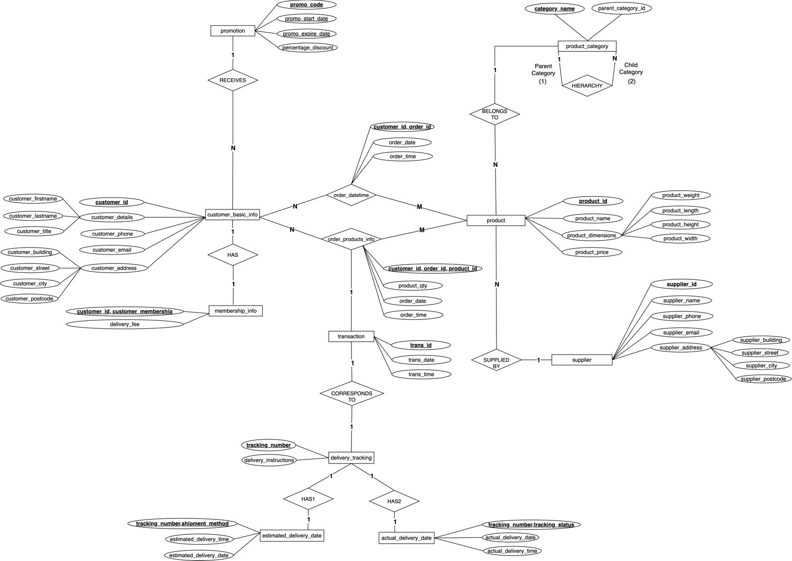

# Overview

The most crucial aspect of any thriving e-commerce business is the skilled management of data. Recognizing this, our project simulates a real-world e-commerce data environment, where our primary goal is to construct a robust database that can not only handle the high volume of transactions characteristic of busy online platforms but also organize data effectively to streamline operations. By recreating a realistic e-commerce scenario, we aim to ensure that businesses remain adaptable, perceptive, and ahead in the fast-paced world of e-commerce.

# Part 1: Database Design and Implementation

## 1.1 E-R Diagram Design

```{r}

```
                         Figure 5: ER Diagram 

The architecture of our e-commerce database is structured around seven key entities: customer, product, product category, supplier, promotion, transaction and delivery. These entities are intricately interconnected through a spectrum of relationships, including one-to-one, one-to-many, many-to-many, and self-referencing, in addition to a central ternary relationship.

The “customer” entity, uniquely identified by “customer_id”, holds detailed attributes and forms a many-to-many relationship with “product” entity, signifying that customers can purchase multiple products, and products can be purchased by various customers.

The “product” entity has “product_id” as the primary key, and is linked to “product category”. It has a one-to-many relationship where one category can encompass numerous products. Furthermore, “product” is similarly linked with “supplier” entity that is uniquely identified by “supplier_id”. It is connected through a one-to-many relationship, under the assumption that one supplier supplies numerous products.

The “product category” entity has a self-referencing relationship with “category_name” as the primary key. It is a hierarchical category structure with one-to-many relationship, as a single parent category can have multiple child categories, but each child category has only one parent category. For instance, “Beauty” is the parent category, and “Body Wash”, “Perfume” and “Hair Styling Product” are the child categories. Each of these child categories would refer back to “Beauty” as their parent, creating a self-referencing relationship.

```{r}
knitr::include_graphics("Self-referencing.png")
```

The “promotion” entity with “promo_code” as the primary key engages in a one-to-many relationship with “Customer” entity, under the assumption that one customer can be associated with one promo code, and many promo code can be associated with multiple customers.

Central to the database, “transaction” captures the financial exchanges and is part of a ternary relationship with “customer” and “product” entities. The three are connected with “order” as the relationship. As mentioned above, the relationship between “customer” and “product” entities is many-to-many. The relationship between “customer” and “transaction” entities is an (N:1) relationship because a customer can have many transactions, but each transaction is associated with one customer. Similarly, “product” and “transaction” has a (M:1) relationship as each transaction involves one or multiple products, but each specific product purchase instance belongs to one transaction.

When considering all three entities together in a ternary relationship (Figure 2): 
• A “customer” can have multiple “transaction” (N:1), and within each transaction, multiple “products” can be involved (M:1). 

• A “product” can be part of multiple “transaction” through different “customers” (M:N), but within a specific transaction, it is uniquely identified.

```{r}
knitr::include_graphics("MN1 Ternary Relationship.png")
```

Lastly, the “delivery” entity, with “delivery_id” as the primary key, correlates with “transaction” table in a one-to-one relationship, where each transaction results in a single delivery instance, ensuring that every purchase is accurately fulfilled.

Each relationship sets are illustrated below:

```{r, eval=FALSE}
knitr::include_graphics("Relationship Sets.jpeg")
```

## Assumptions

To shape our database's logical structure, we have established several assumptions. We assume that each customer and supplier lists only one address within the United Kingdom. Deliveries are direct, unaffected by changes in day or time, handled by our company to ensure consistent customer service. A singular supplier relationship is presumed for each product, and customers receive one unique promo code applicable to their orders. All product prices are listed in GBP, and a delivery fee is structured to favor membership holders with free delivery service.

Moreover, all the suppliers have UK addresses, with every customer and supplier allowed to add only one email address & contact number. All transactions have been completed, with delivery for orders placed before March 2024 assumed to have also been completed (hence no order_status), and the delivery process having started from June 2023. The delivery time is between 7am – 5pm, and each parcel is delivered to each customer’s unique address.

## Logical Schema

Upon completion of the ER diagram, we transition to represent each entity with a distinct table in the database schema, with every attribute corresponding to a column within that table. Consequently, seven tables are established to represent the seven entities: product_category, promotion, supplier, customer, delivery, product and transaction.

When designing the logical schema, a careful review of entity relationships is crucial to determine the need for additional tables. Relationships with cardinalities of 1:1 or N:1 typically do not require extra tables. However, in N:1 relationships, where multiple instances of one entity are associated with a single instance of another, the primary key from the entity on the “1” side transforms into a foreign key in the table on the “N” side. In our ER diagram, we observe that multiple products belong to one product_category (N:1), and multiple products are supplied by one supplier (N:1). Thus, the primary keys “category_name” and “supplier_id” of the weak side are both transferred to the product table as a foreign key. This is the same case for “promo_code” from the promotion table transferred to the customer table as a foreign key.

1.  Customer customer (customer_id, promo_code, customer_firstname, customer_lastname, customer_title, customer_phone, customer_email, customer_membership, delivery_fee, customer_building, customer_street, customer_city, customer_postcode)

2.  Delivery delivery (tracking_number, trans_id, shipment_method, tracking_status, estimated_delivery_date, estimated_delivery_time, actual_delivery_date, actual_delivery_time, delivery_instructions,)

3.  Supplier supplier (supplier_id, supplier_name, supplier_phone, supplier_email, supplier_building, supplier_street, supplier_city, supplier_postcode)

4.  Transaction transaction (trans_id, order_id, trans_date, trans_time)

5.  Product category product_category (category_name, parent_category_id)

6.  Product product (product_id, supplier_id, category_name, product_name, product_weight, product_length, product_height, product_width, product_price, ,)

7.  Promotion promotion (promo_code, promo_start_date, promo_expire_date, percentage_discount)

The order relationship, which contains additional attributes, requires the creation of a separate table.

8.  Order order (customer_id, product_id, order_id, product_qty, order_date, order_time)

## Part 1.2: Database Schema Creation

---
title: "Group17_code"
author: "Group17"
date: "2024-03-13"
output:
  pdf_document:
    toc: yes
    number_sections: yes
  word_document:
    toc: yes
---


\newpage 


```{r setup2, include=FALSE}
library(readr)
library(RSQLite)
library(dplyr)
library(DBI)
```

# List all files

```{r}
all_files <- list.files("Dataset/")
all_files
```

```{r block2,attr.source='.numberLines'}
prefix <- "hi_"
suffix <- "_dataset.csv"
all_files <- gsub("hi_","",all_files)
all_files <- gsub("_dataset.csv","",all_files)
all_files
```

# Using R loops to check data integrity

## Check number of rows and columns
```{r loop,message=FALSE,warning=FALSE,attr.source='.numberLines'}
all_files <- list.files("Dataset/")

for (variable in all_files) {
  this_filepath <- paste0("Dataset/",variable)
  this_file_contents <- readr::read_csv(this_filepath)
  
  number_of_rows <- nrow(this_file_contents)
  number_of_columns <- ncol(this_file_contents)
  
  print(paste0("The file: ",variable,
              " has: ",
              format(number_of_rows,big.mark = ","),
              " rows and ",
              number_of_columns," columns"))
}
```

## Check the data structure
```{r loop1,message=FALSE,warning=FALSE,attr.source='.numberLines'}
all_files <- list.files("Dataset/")

for (variable in all_files) {
  this_filepath <- paste0("Dataset/",variable)
  this_file_contents <- readr::read_csv(this_filepath)
  data_structure<-str(this_file_contents)
  
  print(paste0(data_structure,
               "The file: ",variable,
              " has above data structure"))
}
```

## Check for NULL values
```{r loop2,message=FALSE,warning=FALSE,attr.source='.numberLines'}
all_files <- list.files("Dataset/")

for (variable in all_files) {
  this_filepath <- paste0("Dataset/",variable)
  this_file_contents <- readr::read_csv(this_filepath)
  null<-sum(is.na(this_file_contents))
  
  print(paste0("The file: ",variable,
              " has a total of ", null,
              " NULL values"))
}
```

## Check that each primary key is unique in each table except for order
```{r loop3,message=FALSE,warning=FALSE,attr.source='.numberLines'}
all_files <- list.files("Dataset/")

for (variable in all_files) {
  this_filepath <- paste0("Dataset/",variable)
  this_file_contents <- readr::read_csv(this_filepath)
  hi <- nrow(unique(this_file_contents[,1]))== nrow(this_file_contents)
  
  print(paste0("The file: ",variable,
              " has unique primary key ",
              hi," columns"))
}
```
## For order dataset
We have a composite primary key orderdate_dataset composed of 2 attribute and a composite primary key orderproductsinfo_dataset composed of 3 attribute, we'll check these one separately.
```{r getindividualvalues}
orderdate_dataset <- read.csv("Dataset/hi_order_datetime_dataset.csv")
orderproductsinfo_dataset <- read.csv("Dataset/hi_order_products_info_dataset.csv")
nrow(unique(orderdate_dataset[,1:2])) == nrow(orderdate_dataset)
nrow(unique(orderproductsinfo_dataset[,1:3])) == nrow(orderproductsinfo_dataset)
#sum(nrow(unique(orders[,1:2])))
#length((unique(orders$cutomer_id)))
#length((unique(orders$order_id)))
```
The file: hi_order_dataset.csv has unique primary composite key TRUE columns


# Load Files in an sqlite database 
```{r loadsqlite1,warning=FALSE,error=FALSE,message=FALSE,attr.source='.numberLines'}
#setup the connection
connection <- RSQLite::dbConnect(RSQLite::SQLite(),"hi_import.db")
```


# Drop tables
```{sql connection=connection}
DROP TABLE IF EXISTS product
```

```{sql connection=connection}
DROP TABLE IF EXISTS product_category
```

```{sql connection=connection}
DROP TABLE IF EXISTS promotion
```

```{sql connection=connection}
DROP TABLE IF EXISTS supplier
```

```{sql connection=connection}
DROP TABLE IF EXISTS "transaction"
```

```{sql connection=connection}
DROP TABLE IF EXISTS order_datetime
```

```{sql connection=connection}
DROP TABLE IF EXISTS order_products_info
```

```{sql connection=connection}
DROP TABLE IF EXISTS actual_delivery_date
```

```{sql connection=connection}
DROP TABLE IF EXISTS delivery_tracking
```

```{sql connection=connection}
DROP TABLE IF EXISTS estimated_delivery_date
```

```{sql connection=connection}
DROP TABLE IF EXISTS customer_membership
```

```{sql connection=connection}
DROP TABLE IF EXISTS customer_basic_info
```

```{sql connection=connection}
DROP TABLE IF EXISTS customer
```

```{sql connection=connection}
DROP TABLE IF EXISTS delivery
```

```{sql connection=connection}
DROP TABLE IF EXISTS "order"
```

# Create SQL tables
## product_category
```{sql connection=connection}
-- product_category
CREATE TABLE "product_category" ( 
  category_name VARCHAR(50) PRIMARY KEY,
  parent_category_id CHAR NULL
);
```

```{sql connection=connection}
SELECT * FROM "product_category";
```

## promotion
```{sql connection=connection}
-- promotion
CREATE TABLE "promotion" ( 
  promo_code INT PRIMARY KEY, 
  promo_start_date DATE NULL,
  promo_expire_date DATE NULL,
  percentage_discount NUMERIC NOT NULL
  );

```

```{sql connection=connection}
SELECT * FROM "promotion";
```

## supplier
```{sql connection=connection}
-- supplier
CREATE TABLE supplier ( 
  supplier_id INT PRIMARY KEY, 
  supplier_name CHAR NOT NULL,
  supplier_phone INT NOT NULL,
  supplier_email VARCHAR(50) NOT NULL,
  supplier_building INT NOT NULL,
  supplier_street VARCHAR(50) NOT NULL,
  supplier_city VARCHAR(50) NOT NULL,
  supplier_postcode VARCHAR(50) NOT NULL
) ; 
```


```{sql connection=connection}
SELECT * FROM "supplier";
```

## customer
```{sql connection=connection}
-- customer
CREATE TABLE "customer" ( 
  customer_id INT PRIMARY KEY, 
  promo_code INT,
  customer_firstname VARCHAR(50) NOT NULL,
  customer_lastname VARCHAR(50) NOT NULL,
  customer_title VARCHAR(25) NOT NULL, 
  customer_phone VARCHAR(50) NOT NULL,
  customer_email VARCHAR(50) NOT NULL,
  customer_membership TEXT NOT NULL, 
  delivery_fee NUMERIC NOT NULL,
  customer_building INT NOT NULL,
  customer_street VARCHAR(50) NOT NULL, 
  customer_city VARCHAR(50) NOT NULL, 
  customer_postcode VARCHAR(50) NOT NULL, 
  FOREIGN KEY (promo_code) REFERENCES "promotion"(promo_code)
) ; 
```


```{sql connection=connection}
SELECT * FROM "customer";
```

## delivery
```{sql connection=connection}
-- delivery
CREATE TABLE "delivery" ( 
  tracking_number INT PRIMARY KEY, 
  trans_id INT,
  shipment_method VARCHAR(50) NOT NULL,
  tracking_status VARCHAR(50) NOT NULL,
  estimated_delivery_date DATE NOT NULL,
  estimated_delivery_time TIME NOT NULL,
  actual_delivery_date DATE NULL, 
  actual_delivery_time TIME NULL,
  delivery_instructions VARCHAR(125) NOT NULL,
  FOREIGN KEY (trans_id) REFERENCES "transaction"(trans_id)
); 
```


```{sql connection=connection}
SELECT * FROM "delivery";
```

## product
```{sql connection=connection}
-- product
CREATE TABLE "product" ( 
  product_id INT PRIMARY KEY, 
  supplier_id INT,
  category_name VARCHAR(50),
  product_name VARCHAR(25) NOT NULL,
  product_weight NUMERIC NOT NULL,
  product_length NUMERIC NOT NULL,
  product_height NUMERIC NOT NULL,
  product_width NUMERIC NOT NULL,
  product_price NUMERIC NOT NULL,
  FOREIGN KEY (supplier_id) REFERENCES "supplier"(supplier_id),
  FOREIGN KEY (category_name) REFERENCES "product_category"(category_name)
) ; 

```

```{sql connection=connection}
SELECT * FROM "product";
```


## order
```{sql connection=connection}
-- order
CREATE TABLE "order" (
  order_id INT,
  customer_id INT,
  product_id INT,
  product_qty INT NOT NULL,
  order_date DATE NOT NULL, 
  order_time TIME NOT NULL,
  PRIMARY KEY (order_id, customer_id, product_id),
  FOREIGN KEY (customer_id) REFERENCES "customer"(customer_id),
  FOREIGN KEY (product_id) REFERENCES "product"(product_id)
) ; 
```


```{sql connection=connection}
SELECT * FROM "order";
```

## transaction
```{sql connection=connection}
-- transaction
CREATE TABLE "transaction" (
  trans_id INT PRIMARY KEY,
  order_id INT,
  trans_date DATE NOT NULL,
  trans_time TIME NOT NULL,
  FOREIGN KEY (order_id) REFERENCES "order"(order_id)
);

```

```{sql connection=connection}
SELECT * FROM "transaction";
```


# Normalization to 3NF
## For customer
1. customer_basic_info
```{sql connection=connection}
-- customer_basic_info
CREATE TABLE "customer_basic_info" ( 
  customer_id INT PRIMARY KEY, 
  promo_code INT,
  customer_firstname VARCHAR(50) NOT NULL,
  customer_lastname VARCHAR(50) NOT NULL,
  customer_title VARCHAR(25) NOT NULL, 
  customer_phone VARCHAR(50) NOT NULL,
  customer_email VARCHAR(50) NOT NULL,
  customer_building INT NOT NULL,
  customer_street VARCHAR(50) NOT NULL, 
  customer_city VARCHAR(50) NOT NULL, 
  customer_postcode VARCHAR(50) NOT NULL, 
  FOREIGN KEY (promo_code) REFERENCES "promotion"(promo_code)
) ; 
```

```{sql connection=connection}
SELECT * FROM customer_basic_info
```

2. customer_membership
```{sql connection=connection}
-- customer_membership
CREATE TABLE "customer_membership" ( 
  customer_id INT, 
  customer_membership TEXT, 
  delivery_fee NUMERIC NOT NULL,
  PRIMARY KEY (customer_id, customer_membership),
  FOREIGN KEY (customer_id) REFERENCES "customer_basic_info"(customer_id)
);
```

```{sql connection=connection}
SELECT * FROM customer_membership
```

## For order
1. order_products_info
```{sql connection=connection}
-- order_products_info
CREATE TABLE "order_products_info" (
  order_id INT,
  customer_id INT,
  product_id INT,
  product_qty INT NOT NULL,
  PRIMARY KEY (order_id, customer_id, product_id),
  FOREIGN KEY (customer_id) REFERENCES "customer_basic_info"(customer_id),
  FOREIGN KEY (product_id) REFERENCES "product"(product_id)
) ; 
```

```{sql connection=connection}
SELECT * FROM order_products_info
```

2. order_datetime
```{sql connection=connection}
-- order_datetime
CREATE TABLE "order_datetime" (
  order_id INT,
  customer_id INT,
  order_date DATE NOT NULL, 
  order_time TIME NOT NULL,
  PRIMARY KEY (order_id, customer_id),
  FOREIGN KEY (customer_id) REFERENCES "customer_basic_info"(customer_id)
) ; 
```

```{sql connection=connection}
SELECT * FROM order_datetime
```


## For Delivery
1. delivery_tracking
```{sql connection=connection}
-- delivery_tracking
CREATE TABLE "delivery_tracking" ( 
  tracking_number INT PRIMARY KEY, 
  trans_id INT,
  delivery_instructions VARCHAR(125) NOT NULL,
  FOREIGN KEY (trans_id) REFERENCES "transaction"(trans_id)
); 
```

```{sql connection=connection}
SELECT * FROM delivery_tracking
```

2. estimated_delivery_date
```{sql connection=connection}
-- estimated_delivery_date
CREATE TABLE "estimated_delivery_date" ( 
  tracking_number INT, 
  shipment_method VARCHAR(50),
  estimated_delivery_date DATE NOT NULL,
  estimated_delivery_time TIME NOT NULL,
  PRIMARY KEY (tracking_number, shipment_method),
  FOREIGN KEY (tracking_number) REFERENCES "delivery_tracking"(tracking_number)
); 
```

```{sql connection=connection}
SELECT * FROM estimated_delivery_date
```

3. actual_delivery_date
```{sql connection=connection}
-- actual_delivery_date
CREATE TABLE "actual_delivery_date" ( 
  tracking_number INT, 
  tracking_status VARCHAR(50),
  actual_delivery_date DATE NULL, 
  actual_delivery_time TIME NULL,
  PRIMARY KEY (tracking_number, tracking_status),
  FOREIGN KEY (tracking_number) REFERENCES "delivery_tracking"(tracking_number)
); 
```

```{sql connection=connection}
SELECT * FROM actual_delivery_date
```

# Import csv files into SQL table
## For loop to read csv and then import into sql
```{r}
# Read datasets
#order
order_datetime_dataset <- read.csv("Dataset/hi_order_datetime_dataset.csv")
order_products_info_dataset <- read.csv("Dataset/hi_order_products_info_dataset.csv")

#delivery

actual_delivery_date_dataset <- read.csv("Dataset/hi_actual_delivery_date_dataset.csv")
delivery_tracking_dataset <- read.csv("Dataset/hi_delivery_tracking_dataset.csv")
estimated_delivery_date_dataset <- read.csv("Dataset/hi_estimated_delivery_date_dataset.csv")

#customer
customer_basic_info_dataset <- read.csv("Dataset/hi_customer_basic_info_dataset.csv")
customer_membership_dataset <- read.csv("Dataset/hi_customer_membership_dataset.csv")
product_dataset <- read.csv("Dataset/hi_product_dataset.csv")
product_category_dataset <- read.csv("Dataset/hi_product_category_dataset.csv")
promotion_dataset <- read.csv("Dataset/hi_promotion_dataset.csv")
supplier_dataset <- read.csv("Dataset/hi_supplier_dataset.csv")
transaction_dataset <- read.csv("Dataset/hi_transaction_dataset.csv")
```

```{r loadsqlite,warning=FALSE,error=FALSE,message=FALSE,attr.source='.numberLines'}
dbWriteTable(connection, "product", product_dataset, append = TRUE, row.names = FALSE)
dbWriteTable(connection, "product_category", product_category_dataset, append = TRUE, row.names = FALSE)
dbWriteTable(connection, "promotion", promotion_dataset, append = TRUE, row.names = FALSE)
dbWriteTable(connection, "supplier", supplier_dataset, append = TRUE, row.names = FALSE)
dbWriteTable(connection, "transaction", transaction_dataset, append = TRUE, row.names = FALSE)

#order
dbWriteTable(connection, "order_datetime", order_datetime_dataset, append = TRUE, row.names = FALSE)
dbWriteTable(connection, "order_products_info", order_products_info_dataset, append = TRUE, row.names = FALSE)

#delivery
dbWriteTable(connection, "actual_delivery_date", actual_delivery_date_dataset, append = TRUE, row.names = FALSE)
dbWriteTable(connection, "delivery_tracking", delivery_tracking_dataset, append = TRUE, row.names = FALSE)
dbWriteTable(connection, "estimated_delivery_date", estimated_delivery_date_dataset, append = TRUE, row.names = FALSE)

#customer
dbWriteTable(connection, "customer_membership", customer_membership_dataset, append = TRUE, row.names = FALSE)
dbWriteTable(connection, "customer_basic_info", customer_basic_info_dataset, append = TRUE, row.names = FALSE)
```


## Check the tables using select
```{sql connection=connection}
SELECT * FROM "product" LIMIT 5
```

```{sql connection=connection}
SELECT * FROM "product_category" LIMIT 5
```

```{sql connection=connection}
SELECT * FROM "promotion" LIMIT 5
```

```{sql connection=connection}
SELECT * FROM "supplier" LIMIT 5
```

```{sql connection=connection}
SELECT * FROM "transaction" LIMIT 5
```

Order:
```{sql connection=connection}
SELECT * FROM "order_datetime" LIMIT 5
```

```{sql connection=connection}
SELECT * FROM "order_products_info" LIMIT 5
```

Delivery
```{sql connection=connection}
SELECT * FROM "actual_delivery_date" LIMIT 5
```

```{sql connection=connection}
SELECT * FROM "delivery_tracking" LIMIT 5
```

```{sql connection=connection}
SELECT * FROM "estimated_delivery_date" LIMIT 5
```

Customer: 
```{sql connection=connection}
SELECT * FROM "customer_membership" LIMIT 5
```

```{sql connection=connection}
SELECT * FROM "customer_basic_info" LIMIT 5
```

# Calculated Field
## Transaction amount
```{sql connection=connection}
SELECT o.order_id, prm.percentage_discount, m.delivery_fee, SUM(p.product_price*o.product_qty) AS order_price, ROUND(SUM(p.product_price* o.product_qty)*(1 - CAST(prm.percentage_discount AS REAL) / 100) + m.delivery_fee,2) AS trans_amount
FROM "order_products_info" o, "product" p, "promotion" prm, "customer_basic_info" c, "customer_membership" m
WHERE o.customer_id = m.customer_id AND o.product_id = p.product_id AND c.promo_code = prm.promo_code AND m.customer_id = c.customer_id
GROUP BY 
    o.order_id;

```

# Store natively it in R
```{r}
# Customer
customer_membership <- dbReadTable(connection, "customer_membership")
customer_basic_info <- dbReadTable(connection, "customer_basic_info")

#Delivery
actual_delivery_date <- dbReadTable(connection, "actual_delivery_date")
delivery_tracking <- dbReadTable(connection, "delivery_tracking")
estimated_delivery_date <- dbReadTable(connection, "estimated_delivery_date")

#Order
order_datetime <- dbReadTable(connection, "order_datetime")
order_products_info <- dbReadTable(connection, "order_products_info")

product <- dbReadTable(connection, "product")
product_category <- dbReadTable(connection, "product_category")
promotion <- dbReadTable(connection, "promotion")
supplier <- dbReadTable(connection, "supplier")
transaction <- dbReadTable(connection, "transaction")
```


# List tables
```{r listtables}
RSQLite::dbListTables(connection)
```


# Disconnect SQL
```{r disconnect}
RSQLite::dbDisconnect(connection)
```

# Data Validation
## Validate phone number
```{r getindividualvalues1}
# Supplier
length(grepl("\\+44\\s\\d{3}\\s\\d{3}\\s\\d{4}", supplier$supplier_phone)) == nrow(supplier)
# Consumer
length(grepl("\\+44\\s\\d{3}\\s\\d{3}\\s\\d{4}", customer_basic_info$customer_phone)) == nrow(customer_basic_info)
```

## Validate emails
```{r getindividualvalues2}
# Supplier
length(grepl("@", supplier$supplier_email)) == nrow(supplier)
# Consumer
length(grepl("@", customer_basic_info$customer_email)) == nrow(customer_basic_info)
```


```{r}

```

```         
              Figure 5: ER Diagram - After Normalisation
```
